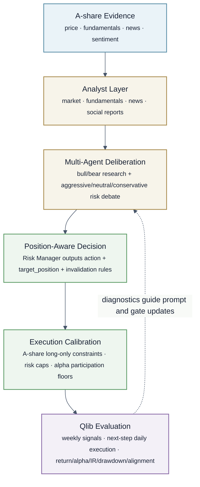

# TradingAgents Alpha-Oriented Flow

This diagram summarizes the current A-share TradingAgents pipeline at a method level: evidence is converted into analyst reports, debated by multiple agents, transformed into target positions, calibrated under A-share constraints, and evaluated through Qlib.

